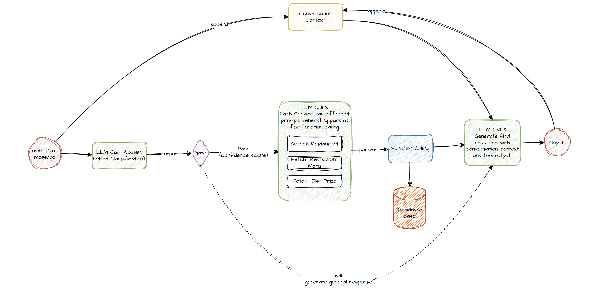

# Restaurant Agent Assignment
## Goal
Build an intelligent restaurant assistant that can handle multi-turn conversations, process user queries, and interact with external tools (e.g., restaurant databases, reservation systems) to provide real-time information.

### State Transition Diagram

### Key Steps (agent flow)

1. **User Intent & Query Routing**  
   - Detects user intent (`fetch_menu`, `reserve_restaurant`, etc.).  
   - Routes queries to appropriate services (e.g., `FetchMenuService`).  

2. **Context & Knowledge Retrieval**  
   - Maintains **multi-turn conversation** (e.g., follow-ups on vegan options).  
   - Searches **knowledge base** for restaurant data (menu, pricing, location).  

3. **Function Calling & Response Generation**  
   - Logs key **events** (`intent_identified`, `tool_called`).  
   - Calls **relevant tool** and generates structured responses.  

4. **TODO: Booking & Confirmation**  
   - Handles **reservations**, asks for **confirmation**, and finalizes booking.  

#### Current Tools:

- Fetch menu
- Check table availability
- Make a reservation
- Fetch price
- Search restaurant

### TODO Work
- Pluggable model support
- Handle vague user queries (e.g., "I need something spicy near me")
- Support voice input in later versions
- Personalization based on past interactions
- Other language integration
- SQL knowledge base for proper tool calling.

#### Current Agent Limitations
- Spelling mistakes not tolerated for query searches
- Restaurant names must be exact, including "The" or numbers (e.g., "The Grill House" is different from "Grill House")
- Context retention limited to short-term memory (improving over time with training)
- Each query takes some time to process by the model.
- Text generation model has limitation with token generated, or detecing <EOS>. Instruction tuned model for chat will give better results. Current Agent requires a lot of regex filtering of the model output.
- Powerful model can classify the query intent, and the search intent with much more accuracy.
- Recommendation criteria is free formed, not tightly bound.
- Reservation's are stored as json object, not updated in a DB (time constraints).
- Availabily check needs proper DB, right now only a reservation json is checked.
- Data model limitations, need sql for better query generation, right now json doesnt look elegant
